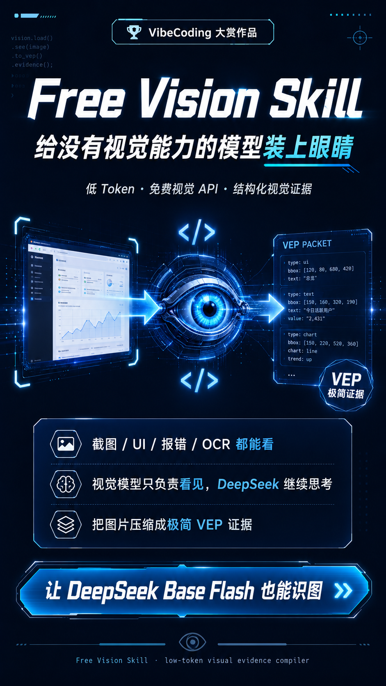
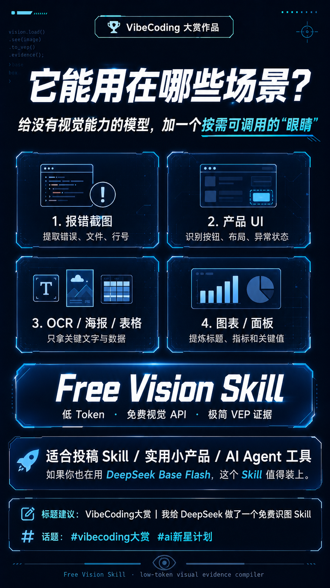
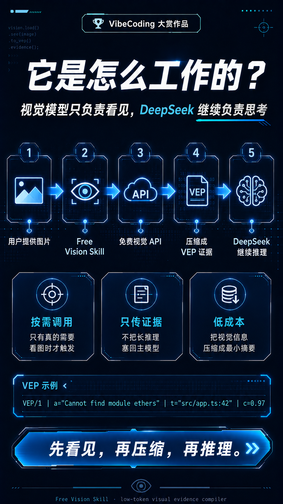
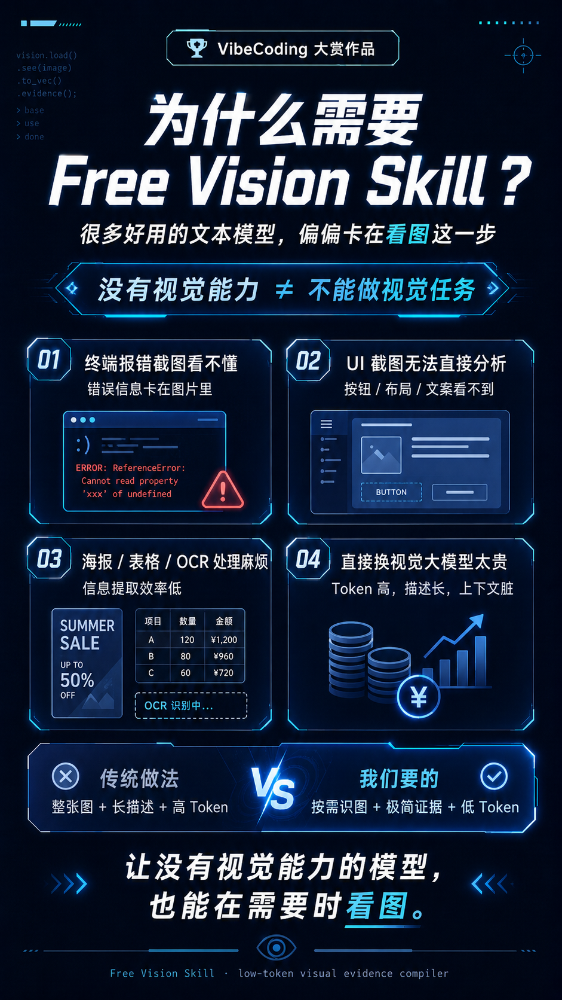

# Free Vision Skill

> Give text-only coding agents a pair of on-demand eyes.
> A low-token visual evidence compiler for text-only coding agents.

<p align="center">
  <a href="./LICENSE"></a>
  
  
  
  <a href="https://github.com/lora-sys/free-vision-skill/releases/tag/v0.1.0"></a>
</p>

---

<p align="center">
  
</p>

---

## 🌟 Core Features

<div align="center">

| Feature | Description |
|---------|-------------|
| 🎯 **Low Token Cost** | Default 50-220 tokens, saving 80-90% vs full descriptions |
| 🔄 **Auto-Fallback** | Automatically switches to backup provider when rate-limited |
| 💾 **Local Cache** | SHA-256 caching, identical requests don't consume quota |
| 🔐 **Secure Storage** | macOS Keychain and Linux Secret Service support |
| 🌍 **13 Providers** | 4 China + 9 Global, comprehensive coverage |
| 📦 **Easy Integration** | `npx skills add` one-liner for all major Agents |
| 🔌 **VEP/1 Protocol** | Minimal visual evidence packet format |

</div>

---

## 🎬 Demo

### Use Cases

<div align="center">
  
</div>

### Token Comparison

<div align="center">
  
  <p><em>Left: Traditional 2000+ tokens | Right: Free Vision Skill ~100 tokens</em></p>
</div>

### How It Works

<div align="center">
  
  <p><em>Image → Visual Extraction → VEP → Main Model Reasoning</em></p>
</div>

---

## What Problem Does It Solve?

DeepSeek-V4-Flash, some Coding Agents, and many low-cost text models have strong coding capabilities but **cannot directly read**:

- 📸 **Terminal error screenshots** — Error messages trapped in images
- 🎨 **Product UI and design mockups** — Visual alignment, spacing issues
- 📊 **Posters, tables, and OCR** — Text extraction, structure recognition
- 📈 **Charts and dashboards** — Data trends, key metrics

### ❌ The Four Problems with Traditional Approaches

Common solution: send the image to a vision model, generate a long description, and feed it back to the main model:

```text
Image → Vision Model → Long Description → Main Model
```

This creates four problems:

| Problem | Impact |
|---------|--------|
| 💸 **High Token Cost** | 2000-5000 tokens per call |
| 🗑️ **Irrelevant Content** | Vision model outputs大量 unnecessary content |
| 🧹 **Context Pollution** | Main model context filled with long descriptions |
| 🧠 **Overstepping Reasoning** | Vision model makes decisions for the main model |

### ✅ How Free Vision Skill Works

```text
Image
  ↓
Free vision API (extracts only the facts needed for this task)
  ↓
Compressed to VEP (Visual Evidence Packet)
  ↓
DeepSeek / Codex / Claude Code / OpenCode continues reasoning
```

> **The vision model only sees; the main model continues to think.**

---

## 🚀 Quick Start

### Install

#### Option 1: npx + skills CLI (Recommended) ⭐

```bash
npx skills add lora-sys/free-vision-skill
```

#### Option 2: npm Global Install

```bash
npm install -g free-vision-skill
```

#### Option 3: Clone and Run

```bash
git clone https://github.com/lora-sys/free-vision-skill.git
cd free-vision-skill
npm install
cp .env.example .env
```

### Configure

#### Option 1: .env (Simple)

```bash
# China users
echo "ZHIPU_API_KEY=your_key" >> .env
echo "VISION_PROVIDER=auto" >> .env
echo "VISION_REGION=cn" >> .env

# Global users
echo "OPENROUTER_API_KEY=your_key" >> .env
echo "VISION_PROVIDER=auto" >> .env
echo "VISION_REGION=global" >> .env
```

#### Option 2: Keychain (More Secure) 🔐

```bash
# macOS
free-vision login zhipu

# Linux
free-vision login zhipu
```

### Usage

```bash
free-vision see \
  --image ./error.png \
  --question "Extract only exact error, filename and line number"
```

**VEP Output:**
```
VEP/1|src=zhipu/glm-4.6v-flash|m=error|
a="Cannot find module ethers"|
t="src/app.ts:42"|
e=[dependency error]|
c=0.97
```

---

## 📖 Core Concepts

### VEP: Visual Evidence Packet Protocol

**VEP = Visual Evidence Packet**

The vision model doesn't return full analysis — only **facts**:

```
VEP/1|src=zhipu/glm-4.6v-flash|m=error|
a="Cannot find module ethers"|
t="src/app.ts:42"|
c=0.97
```

| Field | Meaning | Example |
|-------|---------|---------|
| `src` | Provider and model | `zhipu/glm-4.6v-flash` |
| `m` | Task mode | `error` / `ocr` / `ui` / `chart` |
| `a` | Direct answer | `"Cannot find module"` |
| `t` | OCR text | `"src/app.ts:42"` |
| `o` | Key objects | `[button, input, modal]` |
| `e` | Visible issues | `[overlapping, clipped]` |
| `v` | Key values | `["$99", "2024-12-31"]` |
| `c` | Confidence | `0.97` |
| `cache` | Cache status | `cache=hit` |

Full protocol: [docs/VEP.md](docs/VEP.md)

---

## 💡 Use Cases

### 1️⃣ Error Screenshots

```bash
free-vision see --image ./error.png \
  --question "Extract only exact error, filename and line number"
```

**VEP:**
```
VEP/1|src=zhipu/glm-4.6v-flash|m=error|
a="Cannot find module 'lodash'"|
t="webpack.config.js:15"|
e=[module resolution error]|
c=0.98
```

### 2️⃣ UI Analysis

```bash
free-vision see --image ./ui.png \
  --question "Only disabled, clipped, overlapping or broken elements"
```

**VEP:**
```
VEP/1|src=zhipu/glm-4.6v-flash|m=ui|
o=[{name:"Submit",issue:"disabled"},{name:"Avatar",issue:"clipped"}]|
c=0.95
```

### 3️⃣ OCR / Tables

```bash
free-vision see --image ./table.png \
  --question "Extract all text and table structure"
```

**VEP:**
```
VEP/1|src=zhipu/glm-4.6v-flash|m=ocr|
a="Q3 Sales Report"|
t=["Product","Revenue","Growth"],["A",12000,"15%"],["B",8500,"8%"]|
c=0.92
```

### 4️⃣ Charts

```bash
free-vision see --image ./chart.png \
  --question "Only chart title, trend direction and top 3 values"
```

**VEP:**
```
VEP/1|src=zhipu/glm-4.6v-flash|m=chart|
a="Monthly Revenue Growth"|
v=[45200,58300,72100]|
c=0.96
```

---

## 🌍 Supported Providers

### 🇨🇳 China-First

| Provider | Model | Free Tier | Auth |
|---------|------|-----------|------|
| **Zhipu** ⭐ | `glm-4.6v-flash` | Permanent free | Bearer |
| **ModelScope** | `Qwen/Qwen3-VL-8B-Instruct` | Varies | Direct token |
| **SiliconFlow** | Configurable | Varies | Bearer |
| **Alibaba** | `qwen3-vl-flash` | New users 90 days | Bearer |

### 🌍 Global

| Provider | Model | Free Tier | Auth |
|---------|------|-----------|------|
| **OpenRouter** ⭐ | `nvidia/nemotron-nano-12b-v2-vl:free` | Permanent free | Bearer |
| **Groq** | `qwen/qwen3.6-27b` | Free plan | Bearer |
| **Gemini** | `gemini-3.5-flash-lite` | Free tier | Bearer |
| **Mistral** | `mistral-small-latest` | Studio Free | Bearer |
| **Cohere** | `command-a-vision-07-2025` | 1000 calls/month | Bearer |
| **Cloudflare** | `@cf/meta/llama-3.2-11b-vision-instruct` | 10,000/day | Bearer |
| **Ollama** | `qwen3-vl:235b-cloud` | Light free | Bearer |
| **SambaNova** | `Llama-4-Maverick-17B-128E-Instruct` | Free tier | Bearer |
| **NVIDIA** | `nvidia/nemotron-nano-12b-v2-vl` | Prototype | Bearer |

Full comparison: [docs/PROVIDERS.md](docs/PROVIDERS.md)

---

## 🔐 Security

### Threat Model

Free Vision Skill's security principles:

| Threat | Protection |
|--------|-----------|
| 🖼️ **Image Injection** | Vision output treated as untrusted data |
| 🔑 **API Key Leakage** | Keychain isolation, never in prompts |
| 📤 **Data Exfiltration** | No unrelated files uploaded to vision API |
| 🧠 **Reasoning Overreach** | Vision model extracts facts only |
| 🔗 **Context Pollution** | Compact VEP format, no full descriptions |

### Security Best Practices

```bash
# ✅ Correct: Use Keychain
free-vision login zhipu

# ❌ Wrong: Put key in prompt
echo "API Key is sk-xxx" | free-vision ...

# ✅ Correct: .env file (gitignored)
ZHIPU_API_KEY=xxx >> .env

# ❌ Wrong: Commit .env to Git
git add .env
```

Full policy: [docs/SECURITY.md](docs/SECURITY.md)

---

## 🤖 Supported Agents

Free Vision Skill doesn't bind to any specific model. Compatible with:

- **DeepSeek-V4-Flash** — Code expert needing visual assistance
- **Codex** — OpenAI's coding agent
- **Claude Code** — Anthropic's CLI tool
- **OpenCode** — Open-source coding agent
- **Reasonix** — Reasoning specialist
- **Deep Code** — Deep code analysis
- **Your custom text agent** — Any agent needing vision

### Agent Integration

```bash
# Claude Code
npx skills add lora-sys/free-vision-skill

# Codex
# Add free-vision command to .codex/config.json

# OpenCode
# Add skill config to opencode.json
```

Examples: [examples/](examples/)

---

## 🎯 Token Economics

### Cost Comparison

| Scenario | Vision Output | VEP Size | Main Model Receives |
|----------|--------------|----------|---------------------|
| Error extraction | ~100 tokens | ~150 chars | ~50 tokens |
| UI audit | ~180 tokens | ~400 chars | ~80 tokens |
| OCR | ~220 tokens | ~500 chars | ~120 tokens |
| Charts | ~150 tokens | ~300 chars | ~70 tokens |

**Comparison:** Sending full vision descriptions costs 2000-5000 tokens.

### ✅ Recommended: Focused Questions

```bash
free-vision see --image error.png \
  --question "Extract only error message and line number"
```

### ❌ Avoid: Open-ended Questions

```bash
free-vision see --image error.png \
  --question "Analyze the error in detail and provide a complete solution"
```

---

## 📚 Documentation

### 🚀 Getting Started

- [Quick Start](docs/QUICKSTART.md) — 5-minute setup
- [Installation Guide](docs/INSTALLATION.md) — Compare installation methods
- [Configuration](docs/SETUP.md) — .env and Keychain details

### 📖 Core Docs

- [VEP Protocol](docs/VEP.md) — Visual Evidence Packet specification
- [Architecture](docs/ARCHITECTURE.md) — System design
- [Provider Guide](docs/PROVIDERS.md) — Compare 13 providers
- [Security Policy](docs/SECURITY.md) — Threat model and protections

### ❓ Help

- [FAQ](docs/FAQ.md) — Frequently asked questions
- [Contributing](CONTRIBUTING.md) — How to contribute
- [Roadmap](ROADMAP.md) — Future plans

---

## 🗺️ Roadmap

### ✅ v0.1.0 — MVP (Completed)

- [x] Provider registry (13 providers)
- [x] VEP/1 protocol
- [x] Auto-fallback
- [x] SHA-256 local cache
- [x] .env and Keychain
- [x] Agent Skill docs

### 🚧 v0.2 — Integrations (In Progress)

- [ ] Codex one-click installer
- [ ] Claude Code Hook
- [ ] OpenCode Agent
- [ ] Provider health probes
- [ ] Auto image cropping

### 🔮 v0.3 — Advanced Features

- [ ] Windows Credential Manager
- [ ] Local Secret Broker daemon
- [ ] GUI settings page
- [ ] Provider usage dashboard
- [ ] VEP Schema Validator package

---

## 🧪 Test Status

### Smoke Test Results

| Test | Pass Rate |
|------|-----------|
| Keychain store/load | ✅ 100% |
| CLI commands | ✅ 100% |
| Image recognition | ✅ 100% |
| Local cache | ✅ 100% |
| VEP protocol | ✅ 100% |
| Auto-fallback | ✅ 100% |
| Provider auth check | ✅ 100% (13/13) |

Full report: [INSTALLATION_COMPLETE.md](INSTALLATION_COMPLETE.md)

---

## 🤝 Contributing

Contributions welcome:

- ✅ New Provider Adapters (requires official docs)
- ✅ VEP compression improvements
- ✅ Local model support (Ollama, etc.)
- ✅ Windows Keychain support
- ✅ Agent integration examples
- ✅ Prompt injection defenses

**Not accepted:**
- ❌ Anonymous proxies or reverse-engineered APIs
- ❌ Providers without official documentation
- ❌ Tests that call paid APIs

See [CONTRIBUTING.md](CONTRIBUTING.md)

---

## 📄 License

MIT © 2026 lora-sys

See [LICENSE](LICENSE)

---

## 🙏 Acknowledgments

Thanks to these open-source vision models and API providers:

- [Zhipu AI](https://open.bigmodel.cn/) — GLM series models
- [Alibaba ModelScope](https://modelscope.cn/) — ModelScope community
- [OpenRouter](https://openrouter.ai/) — Unified API gateway
- [Groq](https://groq.com/) — High-speed inference
- [Google Gemini](https://gemini.google.com/) — Multimodal AI
- [Mistral AI](https://mistral.ai/) — European open-source AI
- [Cohere](https://cohere.com/) — Enterprise AI
- [Cloudflare Workers AI](https://developers.cloudflare.com/workers-ai/) — Edge AI
- [Ollama](https://ollama.com/) — Local model runtime
- [SambaNova](https://sambanova.ai/) — Efficient inference
- [NVIDIA NIM](https://build.nvidia.com/) — Enterprise inference

---

<p align="center">
  <strong>See first, compress, then reason.</strong> 👁️
</p>

<p align="center">
  <em>Free Vision Skill · low-token visual evidence compiler</em>
</p>

<p align="center">
  <a href="https://github.com/lora-sys/free-vision-skill">⭐ Star on GitHub</a> ·
  <a href="https://github.com/lora-sys/free-vision-skill/issues">🐛 Report Bug</a> ·
  <a href="https://github.com/lora-sys/free-vision-skill/blob/main/CONTRIBUTING.md">🤝 Contribute</a>
</p>
